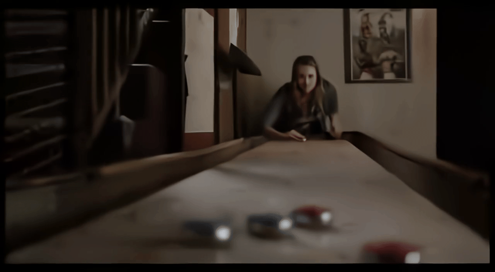
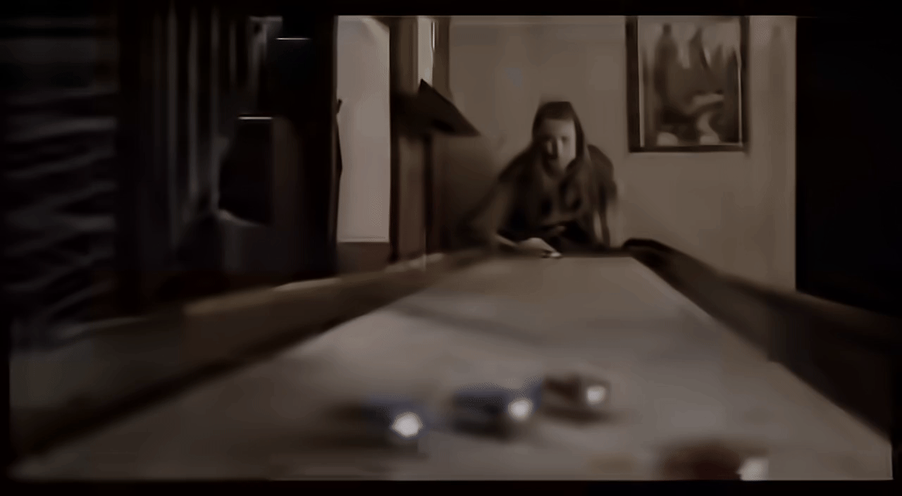
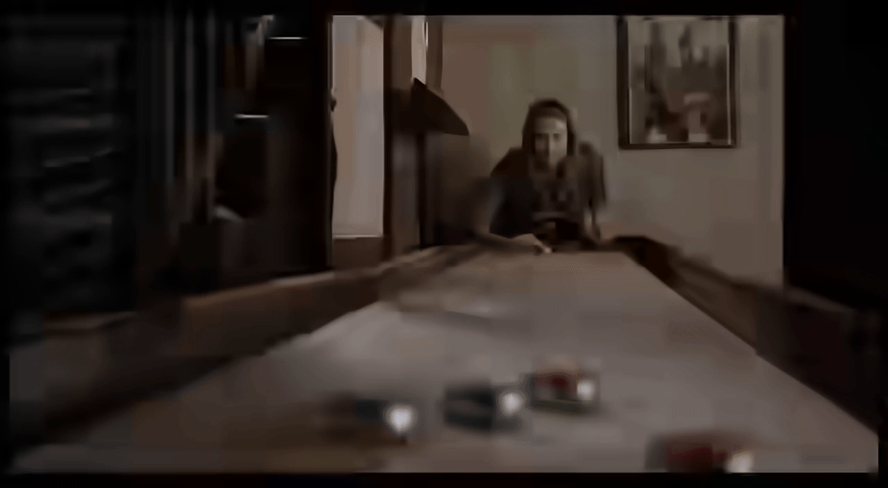
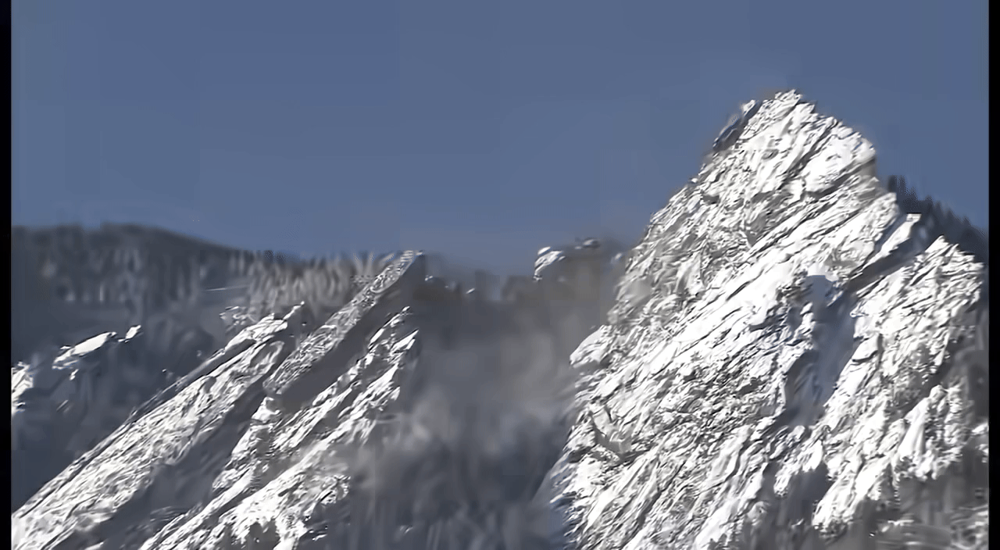
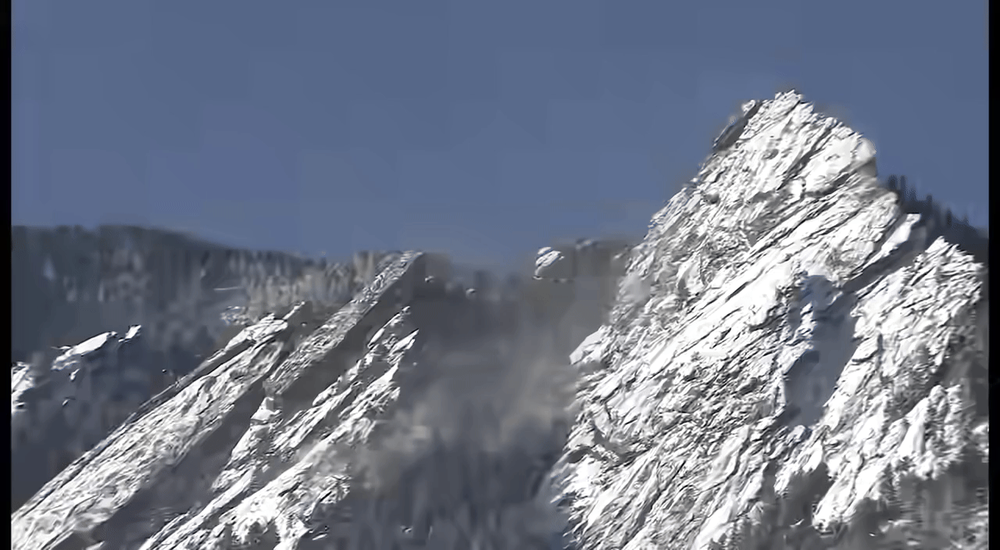

# Visual Results for Generative Video Compression at Extremely Low Bitrates

This repository provides **visual comparison results** for our ICML submission:

> **Title:***Group-of-Latents: Perceptual Video Compression at Extremely-Low Bitrates via Masked Latent Generative Modeling*  
> **Authors:** *Anonymous submission for ICML review*

The goal of this page is to offer **intuitive visual evidence** of the compression behavior of different methods under **extremely constrained bitrate budgets**, where traditional metrics alone may be insufficient.

---

## 1. Overview

Most conventional video codecs and end-to-end learned codecs attempt to preserve **both spatial structure and temporal motion** by jointly encoding intra- and inter-frame information into the bitstream.  
However, under **extremely low bitrates**, the available rate budget becomes insufficient to faithfully represent both aspects.

Our method prioritizes **structure-preserving representation** by encode only **I-Latent** into bitstream, while utilizing the generative model to efficiently recover the **P-latent** containing video **motion information**. This mechanism enables high-fidelity temporal dynamics reconstruction with zero additional bitrate overhead。

---

## 2. Visual Quality of Our Work at Ultra-Low Bitrates

Below we present a direct visual comparison at the **extremely-low bitrate**.

**Sequence:** GIF (1280 x 720), 5 fps, 15 frames  
**Bitrate range:** 0.001 ~ 0.008 (same for all methods)

  
  &nbsp;&nbsp;&nbsp;&nbsp;
   
  <em>Sequence A: &nbsp; bpp @ 0.0015 </em>
  &nbsp;&nbsp;&nbsp;&nbsp;&nbsp;&nbsp;&nbsp;&nbsp;&nbsp;&nbsp;&nbsp;&nbsp;&nbsp;&nbsp;&nbsp;&nbsp;&nbsp;&nbsp;&nbsp;&nbsp;&nbsp;&nbsp;&nbsp;&nbsp;&nbsp;&nbsp;
  &nbsp;&nbsp;&nbsp;&nbsp;&nbsp;&nbsp;&nbsp;&nbsp;&nbsp;&nbsp;&nbsp;&nbsp;&nbsp;&nbsp;&nbsp;&nbsp;&nbsp;&nbsp;&nbsp;&nbsp;&nbsp;&nbsp;&nbsp;&nbsp;&nbsp;&nbsp;
 <em>Sequence B: &nbsp; bpp @ 0.0015 </em>

  
  &nbsp;&nbsp;&nbsp;&nbsp;
   
 <em>Sequence C: &nbsp; bpp @ 0.0031 </em>
  &nbsp;&nbsp;&nbsp;&nbsp;&nbsp;&nbsp;&nbsp;&nbsp;&nbsp;&nbsp;&nbsp;&nbsp;&nbsp;&nbsp;&nbsp;&nbsp;&nbsp;&nbsp;&nbsp;&nbsp;&nbsp;&nbsp;&nbsp;&nbsp;&nbsp;&nbsp;
  &nbsp;&nbsp;&nbsp;&nbsp;&nbsp;&nbsp;&nbsp;&nbsp;&nbsp;&nbsp;&nbsp;&nbsp;&nbsp;&nbsp;&nbsp;&nbsp;&nbsp;&nbsp;&nbsp;&nbsp;&nbsp;&nbsp;&nbsp;&nbsp;&nbsp;&nbsp;
 <em>Sequence D: &nbsp; bpp @ 0.0062 </em>

---

## 3. Comparison with State-of-the-Art (GIF Demo)
The following GIFs provide a qualitative comparison between our method and representative state-of-the-art video compression approaches at ultra-low bitrates.
All methods are evaluated under comparable rate constraints, and the examples highlight differences in structural fidelity and temporal consistency.

> **For better visual inspection, we kindly suggest viewing this page at a larger zoom level to more clearly observe the quality differences among compression models.**
> 
<table align="center">
  <tr>
    <th>Bitrate range</th>
    <th><b>Ground truth</b></th>
    <th><b>Ours</b></th>
    <th>Method A (GLCvideo @ CVPR'23)</th>
    <th>Method A (DCVC)</th>
    <th>Method B (ECM)</th>
    <th>Method B (VTM)</th>
  </tr>

  <!-- ===== Bitrate: 0.001 ~ 0.003 ===== -->
  <tr>
    <td rowspan="2" align="center"><b>0.001 ~ 0.003</b></td>
    <td align="center">
       
    </td>
    <td align="center">
         bpp @ 0.0015
    </td>
    <td align="center">
        bpp @ 0.0078
    </td>
    <td align="center">
        bpp @ 0.002
    </td>
     <td align="center">
        bpp @ 0.0016
    </td>
    <td align="center">
        bpp @ 0.0016
    </td>
  </tr>

  <tr> 
    <td align="center">
      
    </td>
    <td align="center">
        bpp @ 0.0015
    </td>
    <td align="center">
        bpp @ 0.0078
    </td>
    <td align="center">
        bpp @ 0.002
    </td>
     <td align="center">
        bpp @ 0.0016
    </td>
    <td align="center">
        bpp @ 0.0016
    </td>
  </tr>

  
  <!-- ===== Bitrate: 0.003 ~ 0.008 ===== -->
   <tr>
    <td rowspan="3" align="center"><b>0.003 ~ 0.008</b></td>
    <td align="center">
       
    </td>
    <td align="center">
         bpp @ 0.0031
    </td>
    <td align="center">
        bpp @ 0.0078
    </td>
    <td align="center">
        bpp @ 0.0047
    </td>
     <td align="center">
        bpp @ 0.0033
    </td>
    <td align="center">
        bpp @ 0.0033
    </td>
  </tr>

  <td align="center">
       
    </td>
    <td align="center">
         bpp @ 0.0031
    </td>
    <td align="center">
        bpp @ 0.0078
    </td>
    <td align="center">
        bpp @ 0.0047
    </td>
     <td align="center">
        bpp @ 0.0033
    </td>
    <td align="center">
        bpp @ 0.0033
    </td>
  </tr>

  <td align="center">
       
    </td>
    <td align="center">
         bpp @ 0.0062
    </td>
    <td align="center">
        bpp @ 0.0078
    </td>
    <td align="center">
        bpp @ 0.010
    </td>
     <td align="center">
        bpp @ 0.0033
    </td>
    <td align="center">
        bpp @ 0.0033
    </td>
  </tr>
</table>

--- 
## 4. Key Observations and Qualitative Analysis

Based on the visual comparisons above, we highlight several consistent qualitative observations at extremely low bitrates:

- **Structural fidelity.**  
  Our method better preserves global scene layout and object structure, while competing methods often suffer from severe block artifacts or structural collapse when bitrate drops below bpp@0.003.

- **Temporal consistency.**  
  Despite allocating zero bitrate to motion-related latents, our generative reconstruction maintains smoother and more coherent temporal dynamics, whereas other approaches exhibit noticeable flickering, jittering, or frozen regions.

- **Perceptual realism.**  
  Compared to conventional codecs (e.g., VTM, ECM) and learned baselines (e.g., DCVC, GLCVideo), our results demonstrate more natural motion patterns and fewer visually distracting artifacts under comparable rate budgets.

---

## 7. Reproducibility and Code Availability

Due to the double-blind review policy, **training code and model weights are not released at this stage**.  
Upon acceptance, we plan to release:

- Full training and inference code  
- Pre-trained models  
- Scripts for reproducing all visual results shown on this page  

---

## 8. Contact

For questions regarding the visual results or evaluation protocol, please contact the authors after the review process.

